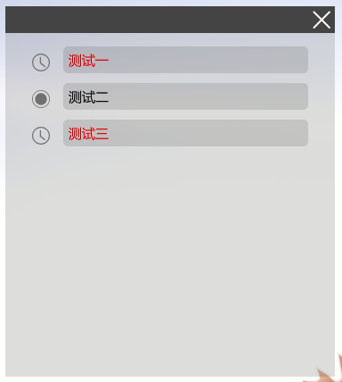
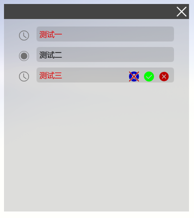
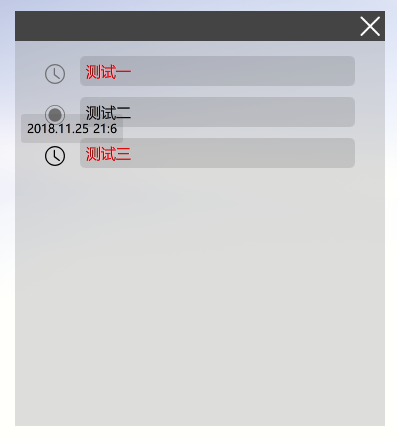
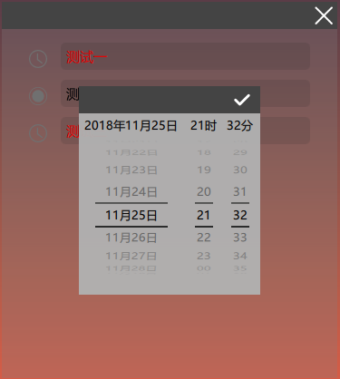

# ToDo
使用Qt Quick构建的清单与定时提醒工具

我需要一个清单工具，但是没有找到特别满意的。有一个叫做小黄条的工具其实挺不错，但是它的源码不开放，所以，不能进行自定义修改，并且有一些细节让我不满意。同时我也正在学习QML，想搞一个Qt Quick的练手项目，所以闲暇的时候会在学习的同时尝试构建这个工具。

模仿与参考对象：小黄条。

图标来自：阿里巴巴矢量图标库。

### 进度

- 2018.11.17，还在尝试学习和实现必须的组件，现在已经基本完成了窗口的自动吸附隐藏和主界面设计，条目的编辑功能正在进行中。

- 2018.11.18，差不多搞定了界面的开发，条目的添加，编辑，包括各种图标以及MouseArea的问题已经搞定了，接下来需要的就是完成具体的功能细节，例如：定时提醒，条目的存档，记录，自动更新等等。对了，也应该搞一个完成项目的列表吧。Qt Quick确实开发起来快得多，组件也好用的多。

- 2018.11.21，完成了提醒弹窗的开发，这个是在模拟MacBook上面的样式，不过我没有MacBook，所以是大概模拟我记忆里面电影里MacBook上面的效果。。。。。然后最最重要的是开发了一个新的控件----DatePicker这个是为后面的定时提醒功能服务的，用来选择时间。然后这个控件对我来说真的是相当复杂的一个组件了，模拟对象是iOS上面的滚筒状时间选择器，效果嘛，我还是挺满意的。这个组件综合使用了PathView,c++，弹窗等，包含了3份源码，虽然有些其实可以不这么复杂。边学边做，一边还要负责具体的界面设计与实现，所以花了很久很久。此外也做了一些界面的微调，包括条目的文字，隐藏窗口的特性等等。

    总而言之，到此为止，大概界面必须的部件都差不多了。剩下的就是具体的实现定时功能，以及我现在最担心的数据的存储与重新加载，还不知道该怎么做。然后，这一段时间学习内容的笔记也还没写。(Ps.写代码的时候听了无数遍孙燕姿的180度，挺好听的)

- 2018.11.25，这几天基本搞定了内部的数据结构，决定了数据使用Sqlite数据库进行本地存储，数据的存储，更新等同样由一个C++组件负责。至于界面这一端，测试之后决定每个条目都会通过信号将条目的信息及时传递给主界面，主界面负责与C++通信传递数据。基本上最重要的工作就是这些了。然后现在也开始在补充新的属性、方法什么的，连接必要的信号，大概快要完成了。但是现在我遇到了问题。。。。主界面是一个Window，界面中的项目时间到了之后也会弹出一个弹窗进行提醒，但是现在发现主界面隐藏之后弹窗无法弹出，如果弹出之后再隐藏主界面，弹窗将无法关闭。如果这个问题不解决，我宁愿放弃。

- 2018.11.25 19：10， Ok, 调试通了，基本上，到现在为止，代码已经写完了，程序已经可用了，当然还会有一些Bug，这是必然的。接下来，我会首先规范一下代码的结构，然后将源码上传，并且给出第一个Release版本，同时给出一份实现的大概细节，已经功能，界面介绍。

### 版本1.0功能介绍

- 主界面，样式如下：

    

    标题栏现在只有一个关闭功能，下方是条目区，每一个条目都是一个待办事项，每个待办事项都可以支持很长的文字输入，甚至包括回车。但是，当然只支持文字输入。现阶段条目的文字编辑功能还几乎没有，也就是说不支持选择，剪切，粘贴这些功能，后续应该会添加。

    点击下方的空白区可以添加一个新的条目，在新的空白条目被编辑之前不能再增加新的条目。

    主界面默认是透明的，后续应该会增加功能为可设置的。

- 隐藏界面。当主界面被拖动至顶部边栏或右侧边栏时，释放鼠标，界面会自动隐藏(现阶段为窗口必须有部分在屏幕外才会被隐藏，后续可能会修改)：

    

    显示为如上所示浅灰色半圆，默认情况下这个半圆会被始终显示在窗口的最顶层，后续应该会增加功能为可设置的。

    点击半圆，窗口会重新出现。

    现阶段，界面对多屏幕的支持情况较差，如果过于靠近第二屏幕可能会出现界面隐藏在错误位置的情况，后续应该会尽量修复。

- 条目功能区

    

    每一个条目当鼠标悬浮在上方时，都会出现三个图标。分别是定时提醒，完成，删除。定时提醒功能决定是否对这个条目开启定时提醒功能，相对应的条目最左侧的图标也会发生相应的变化。定时功能后面会再说。完成图标和删除图标都会导致当前条目从界面中被删除，现阶段还不提供查看被删除的项目和已完成项目的功能。

    新建条目之后，点击会进入编辑。编辑完成之后，只有再次点击这个条目才能退出编辑。

- 定时提醒

每个条目最左侧的图标都有小圆点和时钟两种，前者代表当前项目没有定时提醒功能，后者代表已开启定时提醒，开启之后鼠标悬浮在时钟图标上方会提示当前设置的目标时间。点击时钟图标，将弹出一个模拟iOS的滚轮时间选择窗口：

使用鼠标滚轮可以选择目标时间，时间选择的范围是当天前后各半年，滚轮上方会有详细的提醒。时间的精度为分钟。但是现在的设定是每2秒钟检查一次时间，所以时间的提醒会有最多2秒的延迟。

当条目的时间到达之后，条目的文字将转换为红色，同时屏幕的右上角会弹出弹窗：

弹窗内包含了部分到达时间的条目的文字内容，如果太长只会显示部分，弹窗会被显示在屏幕的最顶层，当前也不可修改。默认弹窗显示30秒，可以点击关闭。弹窗显示的位置不可修改。

另外，由于程序问题，现在只能显示一个弹窗，这意味着如果同时有多个项目到达设定时间弹窗内容会相互覆盖。但是主界面里面对应条目的文字都会被标红。

- 数据存储

现阶段，数据的存储使用Sqlite3数据库，所有数据都包含在程序目录内的`data.db`数据库文件中，每个条目都会被记录，下次打开之后会自动加载。虽然现阶段不支持查看已完成和已删除项目，但是这些项目都会被存储。

因为所有的历史项目都会被保留(除非手动删除了`data.db`)，所以还不确定使用时间过长会不会造成一些问题，有待观察。后面可能会被修改为保留一段时间。

另外，现阶段不支持数据的云端同步。只能存储在本机。

总而言之，现阶段还有很多缺陷，但至少可以用了。

另外，源码还没来得及整理，所以问题比较多，诸如命名不规范，未注释掉输出信息等等。

### 版本1.1

- 重新设置了项目编辑区域的焦点获取逻辑，同时增加了鼠标选择光标位置的功能，也修改了功能图标的显示方式。现在点击条目编辑，根据点击位置确定光标位置，鼠标发生移动，功能图标就会显示。退出编辑点击条目之外的任意区域即可。
- 修改了时间选择滚轮的滚动逻辑，和Windows的惯用逻辑保持一致。
- 修改了条目字体的大小。
- 添加了应用图标
- 同学建议将界面的文字修改为白色，当前的透明灰色确实对暗色桌面不够友好。但是我尝试了很久并没有搞定，我还没有搞懂Qt的Alpha通道叠加规则，得到的白色总是不够纯，Don't know why。界面的整体色调修改其实很麻烦，图标也都要调，todo.......

### 已知BUG

- 因为c++的`DateBackend`设计失误，它只会在程序开启时更新一次，所以后面的话，程序运行几天之后滚轮的显示就会出错。预计更改一下设计就好了，然后滚轮上方的标签的更新方式也不太对。

### 服务器

接下来，大概会逐步的制作一个服务器。服务器提供注册，登陆，同步数据的功能。通信建立在TCP的基础上，服务器计划使用python编写，运行在树莓派和windows上，因此数据库只能选择继续使用sqlite3。

原本计划提供加密的功能，但是好像有点麻烦。我想要的加密自然应该是RSA，但是如果考虑到把密钥固化到软件内部的话，其实一些弱一些的加密手段也可以。总而言之，这只是个规划，初级阶段不会进行任何加密。

其实我也在考虑加密的意义何在，如果我的所有东西都是开放的话，就当练习吧。

至于服务器，可以根据平台自动选择`select,poll还是epoll`。

下面说一下协议的设计

#### 协议

~~~
Design-by-stan
type:xxxxxx
token:xxxxxxx
content-length:xxxxx
content......
~~~

如上，第一行必须是`Design-by-stan`，这相当于是在做一个标记。换行统一使用`\r\n`

第二行是类型，目前规划的类型包括:`sign-in, sign-up, sign-out, insert, update, get, get-all`

这几种类型分别对应:登陆，注册，登出，插入数据，更新数据，获取本用户全部数据，获取所有用户的数据。

第三行是一个令牌，用于保持登陆状态，至于令牌的具体形式还没确定

第四行是内容长度，模拟了http协议

最后就是内容，具体内容自然是根据报文类型来确定的。

服务器将会解析报文，一旦发现任何位置不符合格式就会主动断开和客户端的链接。

#### 数据

我到现在还没想好到底应该怎规划数据，服务器应该怎么存储数据，客户端又应该怎么合并数据。说不定每个条目的设计都要改，也许应该携带一个时间标签的。